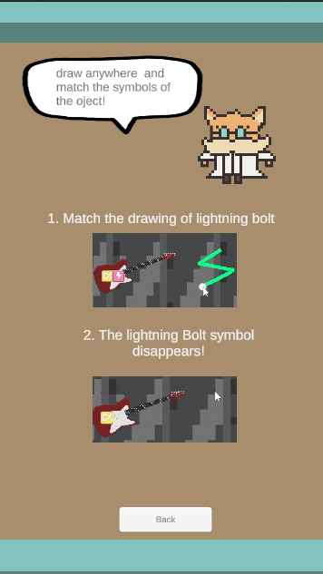

# Cat Scan
Cat Scan is a puzzle drawing game where the Player acts as a cat named Matt, and 
Cat Scan is a cozy-type singleplayer simulation game, where the player has to scan
luggages in an airport and identify if there is contraband in them. They have to draw symbols to ensure that the items gets notified by the scanner.

The game follows a mix-up between Airport Scanner (IOS) and Magic Touch : Wizard For
Hire (Android). The theme follows a cat world with the player playing as a Security Officer
called Matt, a newly recruited feline tasked with scanning the luggages.

## Overview
In this game, players navigate through a menu featuring start, settings, and
leaderboard buttons. The synopsis introduces a world where cats possess items immune to
scanning, necessitating novel scanning technology. 

Gameplay involves a conveyor belt presenting items for scanning, with players controlling the synthesis of drawings to
eliminate them. 

As an endless game, winning is defined by achieving a high score and
securing a place on the leaderboard, with gameplay continuing until all player health points
are lost

## User Manual
- ### Installation: 
  Simply download the game files and launch Unity 2022.3.17f1
  Or
  Download the Cat Scan apk in the code files into mobile, and download the apk package. Requires Android 11 or later.
  
- ### Controls
Use Fingers to draw the shape to match the corresponding shape being attached to the items

## Acknowledgement
We would like to thank our lecturer, Mr Albert for his guidance and support throughout the development of this project.

        
## Video Demo and Screenshots
Watch Video Demo on YouTube: [https://youtu.be/4MH501NE3_c](https://youtu.be/4MH501NE3_c)
<table>
  <tr>
    <td></td>
    <td></td>
  </tr>
  <tr>
    <td></td>
    <td></td>
  </tr>
  <tr>
    <td></td>
    <td></td>
  </tr>
  <tr>
